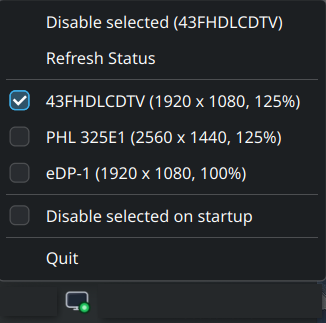

# spatricius-monitor-toggle

Toggle extra monitors on and off from the system tray. Saves power and reduces
GPU load when you don't need them.

Left-click toggles selected monitors. Right-click opens a menu with checkable
monitor selection, refresh status, and a "Disable selected on startup" option.



## Requirements

- KDE Plasma 6 (Wayland)
- `kscreen-doctor` (ships with kwin)
- `python3-gobject` (PyGObject with GdkPixbuf)
- Python 3.10+

Install system dependencies:

```bash
# Fedora
sudo dnf install python3-pip python3-gobject

# Arch
sudo pacman -S python-pip python-gobject

# Debian/Ubuntu
sudo apt install python3-pip python3-venv python3-gi python3-gi-cairo gir1.2-gtk-3.0
```

## Installation

Two options — use the script or do it manually.

### Script

```bash
./install.sh
```

This installs the Python package, copies icons and an autostart desktop file,
then starts the indicator in the background. The autostart file ensures it
starts automatically on future logins.

### Manual

```bash
# Install the Python package
pip install --user .

# Copy icons to system theme dir (for the desktop file)
mkdir -p ~/.local/share/icons/hicolor/scalable/apps
cp spatricius_monitor_toggle/icons/monitor-*.svg ~/.local/share/icons/hicolor/scalable/apps/

# Install autostart desktop file
mkdir -p ~/.config/autostart
cp data/spatricius-monitor-toggle.desktop ~/.config/autostart/

# Start the indicator
~/.local/bin/spatricius-monitor-toggle &
```

## Usage

Left-click the tray icon to toggle selected monitors. Right-click for the menu:

- **Enable selected (…)** / **Disable selected (…)** — toggle checked monitors
- **Refresh Status** — re-read display state
- **Monitor checkboxes** — select which monitors to control
- **Disable selected on startup** — automatically disable checked monitors on login
- **Quit** — stop the indicator

## Configuration

State is stored in `~/.local/state/spatricius-monitor-toggle/`:

| File | Purpose |
|---|---|
| `config.json` | `"auto_disable_on_startup": true/false` |
| `selected-outputs.json` | List of output names to control |
| `layout.json` | Saved KScreen layout (when disabling) |

## Uninstall

Two options — use the script or do it manually.

### Script

```bash
./uninstall.sh
```

Stops the indicator, removes icons and the autostart desktop file, then
uninstalls the Python package.

### Manual

```bash
# Stop the indicator
pkill -f "spatricius-monitor-toggle"

# Remove autostart file and icons
rm -f ~/.config/autostart/spatricius-monitor-toggle.desktop
rm -f ~/.local/share/icons/hicolor/scalable/apps/monitor-*.svg

# Uninstall the Python package
pip uninstall spatricius-monitor-toggle -y
```
